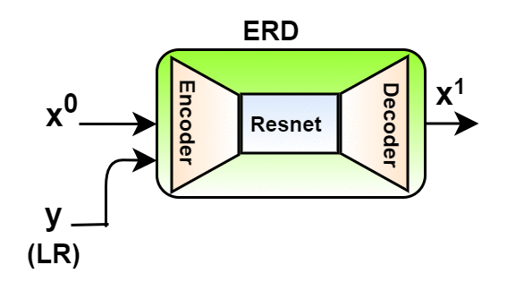
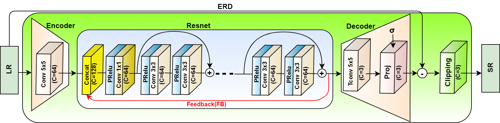
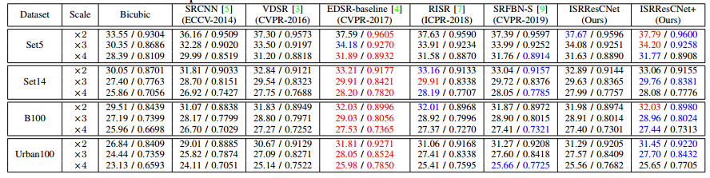
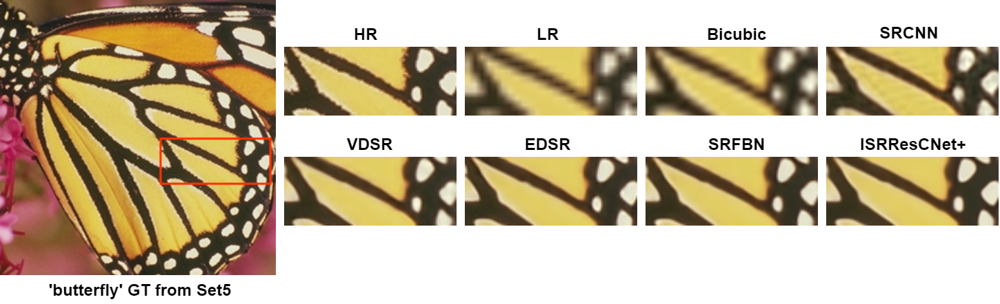
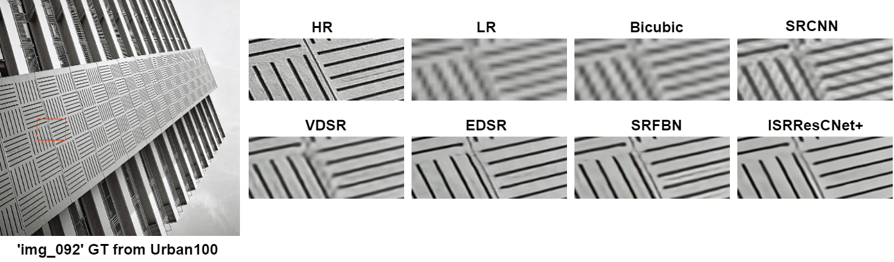

# Deep Iterative Residual Convolutional Network for Single Image Super-Resolution (ISRResCNet)
An official PyTorch implementation of the [ISRResCNet](https://github.com/RaoUmer/ISRResCNet) network as described in the paper **[Deep Iterative Residual Convolutional Network for Single Image Super-Resolution](https://arxiv.org/abs/2009.04809)** which is published in the 25th International Conference of Pattern Recognition (ICPR), 2020.

#### Abstract
Deep convolutional neural networks (CNNs) have recently achieved great success for single image super-resolution (SISR) task due to their powerful feature representation capabilities. The most recent deep learning based SISR methods focus on  designing deeper / wider models to learn the non-linear mapping between low-resolution (LR) inputs and high-resolution (HR) outputs. These existing SR methods do not take into account the image observation (physical) model and thus require a large number of network's trainable parameters with a great volume of training data. To address these issues, we propose a deep Iterative Super-Resolution Residual Convolutional Network (ISRResCNet) that exploits the powerful image regularization and large-scale optimization techniques by training the deep network in an iterative manner with a residual learning approach. Extensive experimental results on various super-resolution benchmarks demonstrate that our method with a few trainable parameters improves the results for different scaling factors in comparison with the state-of-art methods.

#### BibTeX
    @InProceedings{Umer_2020_ICPR,
                   author = {Muhammad Umer, Rao and Luca Foresti, Gian and Micheloni, Christian},
                   title = {Deep Iterative Residual Convolutional Network for Single Image Super-Resolution},
                   booktitle = {Proceedings of the International Conference of Pattern Recognition (ICPR)},
                   month = {January},
                   year = {2021}
                  }

## Quick Test
The code will be released soon...

## ISRResCNet Architecture
#### Overall Representative diagram

  

#### ERD block

  

## Quantitative Results
Average PSNR/SSIM values for scale factors x2, x3, and x4 with the bicubic degradation model. The best performance is shown in **red** and the second best
performance is shown in **blue**.

  

## Visual Results
Visual comparison of our method with other state-of-the-art methods on the x4 super-resolution over the SR benchmarks. For visual comparison on the benchmarks, you can download our results from the Google Drive: [ISRResCNet](https://drive.google.com/drive/folders/1IioErwfd1cjfBMBOjUzH1guWuI-iZzFm?usp=sharing).

  

  

